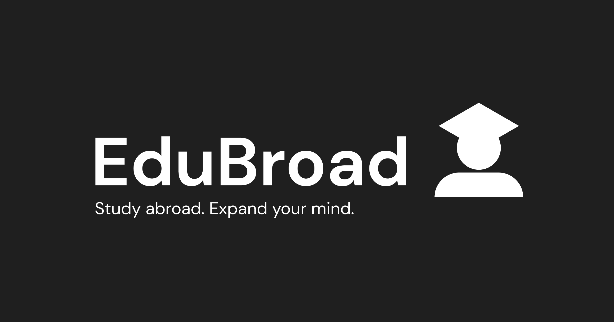

# EduBroad



Heb je altijd al in het buitenland willen studeren maar weet je niet wat de mogelijkheden zijn en of je kan uitwisselen met anderen studenten?

EduBroad maakt het makkelijk om te ontdekken of jouw land en of school in het buitenland plekken vrij heeft om uit te wisselen. Bewerk je profiel, geef je voorkeuren aan en exploreer de wereld naar mogelijkheden.

Dit project is gemaakt voor project tech voor de opleiding CMD op de HvA.

## Features

- Zoek makkelijk op de interactieve kaart naar scholen en studenten in het buitenland.
- Leg contact met de studenten zodat de uitwisseling kan beginnen.
- Richt je profiel in en geef je voorkeur aan welk land je wilt studeren.
- Makkelijk toegangbaar zowel op mobiel als desktop.

## Setup project

Om het project te kunnen opzetten moet je Node en NPM geïnstalleerd hebben op je systeem.

Ook moet je toegang hebben tot MongoDB Atlas database zodat je een connectie url kan generen. Neem daarvoor met mij contact op.

Uiteindelijk moet je in `env.sample` de connectie key toevoegen en nog meer. Ook moet je een account hebben op mapbox zodat je de interactieve mapbox kaart kan gebruiken.

Als dat gelukt is dan kan je het project clonen.


```bash
# install dependencies
$ npm install

# run project locally at localhost:3000
$ npm start
```

## Acknowledgement

Tijdens het project heb ik meerdere resources en services gebruikt die het mogelijk hebben gemaakt om dit project tot stand te brengen.

- [Mapbox](https://www.mapbox.com/)
- [Google Fonts](https://fonts.google.com/)
- [Express framework](https://expressjs.com/)
- [Pug](https://pugjs.org/)
- [MongoDB Atlas](https://www.mongodb.com/atlas/database)
